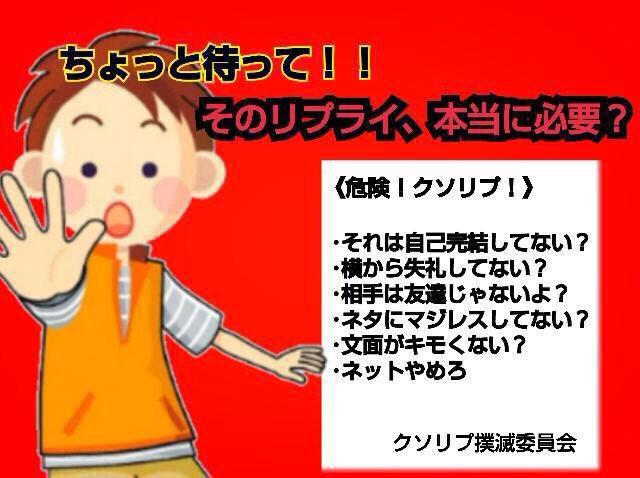

# php04kadai_13_shimazaki87

## 必ず読んでください
アウトプットしたり工夫できる人は１２０％でえらいと思いますが、　 
できない人も悪じゃないと思うので 
悲しい気持ちにならない書き方してください😉　 
 
 
　　 
### 作りたかったもの　　
コンサート情報とセットリストをまとめられるサイトを作りたいと思いました。 
tour_select.phpでは、ツアーの一覧が 
select.phpでは、そのツアーのセットリストが見られるようにしたかったです。 
ツアー情報とセットリストはまだ連動できていません😢 

### 課題内容
ユーザー管理画面？を作りました 
・ユーザー情報を追加し、ログイン・ログアウト処理できるように 
・ログインしていない状態で情報の編集や削除できないように 
・ハッシュ化　　　

### アカウント
・テストアカウント 
ID：test01 
Password:test01 

### 工夫した点・こだわった点
最低限の課題です。 
細部までこだわることができませんでした。 
READMEを書くことが大事とのことだったので、 
色々こだわれなかった分、ちゃんと書くのが今回の目標です。 
今書いてます。えらい！　　

### 及ばなかった点
・CSSやHTMLなど基礎的な部分をもっと綺麗に作りたかった 
・なぜかCSSのflex-boxがうまくできていないのに無視しました 
・ツアー情報とそのツアーのセットリストが連動できるようにしたかった 
・アカウント登録もできるようにしたかった 
　　

